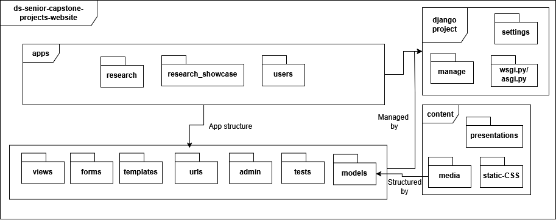
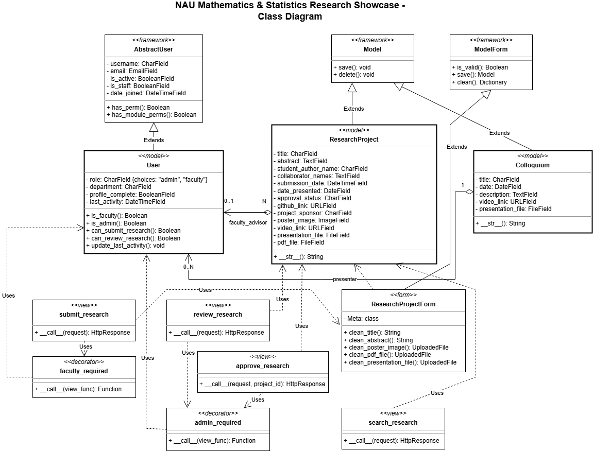

# Design

Group 14

## Team Members

- Ethan Ferguson
- Jack Tomlon
- Karl Reger
- Rylan Harris-Small

## Description

Northern Arizona University Department of Mathematics & Statistics Research Showcase is dedicated to developing a web-based platform for Northern Arizona University's Department of Mathematics & Statistics. This platform aims to organize, archive, and showcase student research, particularly senior capstone projects, with potential expansions for additional research and other departments.

The system addresses the lack of a centralized platform for storing and showcasing student research by providing faculty with the ability to submit projects, administrators with tools to review and approve submissions, and visitors with search functionality to discover relevant research. The platform uses a Django-based architecture with role-based access control to ensure appropriate permissions for different user types while maintaining a clean, intuitive interface for all stakeholders.

## Architecture


### UML Package Diagram



### Architecture Rationale

The system follows Django's [Model-View-Template (MVT)](https://www.geeksforgeeks.org/django-project-mvt-structure/) architectural pattern which is [an adaptation](https://www.askpython.com/django/django-mvt-architecture) of the traditional [Model-View-Controller (MVC)](https://www.geeksforgeeks.org/mvc-architecture-system-design/) pattern. This architecture was chosen for several key reasons:

1. [**Separation of Concerns**](https://www.geeksforgeeks.org/separation-of-concerns-soc/): The MVT pattern cleanly separates data management [(Models)](https://www.geeksforgeeks.org/django-models/), business logic [(Views)](https://www.geeksforgeeks.org/views-in-django-python/), and presentation [(Templates)](https://www.geeksforgeeks.org/django-templates/), making the codebase more maintainable and easier to extend.
2. **Django Framework Alignment**: As a Django application, the architecture leverages Django's built-in tools and conventions, speeding up development and reducing boilerplate code.
3. [**Layered Structure**](https://www.geeksforgeeks.org/types-of-software-architecture-patterns/#1-layered-pattern): The system is organized into three primary layers:
    - Presentation Layer: Templates and static files handling the user interface
    - Application Layer: Views and forms implementing business logic and user workflows
    - Data Layer: Models defining the database schema and relationships
4. [**Modular Design**](https://www.geeksforgeeks.org/effective-modular-design-in-software-engineering/?ref=ml_lbp): The application is divided into focused apps (`users`, `research`, `research_showcase`), each with a specific responsibility, improving code organization and maintainability.
5. [**Security by Design**](https://cheatsheetseries.owasp.org/cheatsheets/Django_Security_Cheat_Sheet.html): The architecture incorporates built-in security features like Django's authentication system and permission decorators, providing protection against common web vulnerabilities.

This architecture provides a solid foundation for fulfilling the primary requirements of the system: allowing faculty to submit research projects, enabling administrators to review submissions, and providing a searchable repository for visitors.


## Class Diagrams




The class diagram represents the key models and their relationships in the system. The implementation details include:

`User Class`:

- Extends Django's AbstractUser with additional role-based permissions
- Includes specific methods for authorization checks (`is_faculty()`, `is_admin()`)
- Contains fields for user profile information like department and activity tracking

`ResearchProject Class`:

- Core model for research submissions with detailed metadata
- Multiple relationships to User model (`author`, `faculty_advisor`)
- Rich attribute set including file uploads and external links
- Status tracking for approval workflow

`Colloquium Class`:

- Model for presentation events
- Connected to User model for presenter tracking
- Includes presentation materials and scheduling information

The diagram accurately reflects the implemented code structure while providing a clear overview of the system's data model. The relationships depicted match the foreign key and many-to-many relationships in the Django models, and the detailed attributes reflect the database fields.

## Sequence Diagrams


Use Case: *Submit Research*

Actor: Faculty

Trigger: Faculty decides to submit a student research project.

Pre-conditions: Faculty is logged in.

Post-condition: Student research submission is recorded and pending admin review.

Success Scenario:

1. Faculty provides student research details (title, studentauthor(s), research category, and faculty advisor).
2. The faculty uploads the research file(s), which may include PDFs, presentations, or images.
3. The system validates the submission and stores the files.
4. The system marks the research as "Pending Review."
5. The system notifies admins that a new research submission is awaiting approval.

Alternate Scenario:

1. The system detects an invalid file format or missing information.
2. The system informs the faculty of the issue and requests corrections.
3. The faculty resubmits the corrected student research.

## Design Patterns

> Split this section into 2 subsections. For each subsection, present a UML class diagram showing the application of a design pattern
>
> Links to an external site. to your system (a different pattern for each section). Each class diagram should contain only the classes involved in the specific pattern (you don’t need to represent the whole system). Choose patterns from two different categories: Behavioral, Structural, and Creational. You are not limited to design patterns studied in class.
>
> Your system may not be appropriate for any design pattern. In this case, for didactic purposes, be creative and extend a little bit the scope of your system to make the design patterns appropriate.
>
> Implement each design pattern in your system and provide GitHub links to the corresponding classes. Example (the links are just illustrative):
>
> ```
> Car: https://github.com/user/repo/blob/master/src/com/proj/main/Car.java 
> ```
>
> Links to an external site. IBreakBehavior: <https://github.com/user/repo/blob/master/src/com/proj/main/IBreakBehavior.java> Links to an external site. BrakeWithABS: <https://github.com/user/repo/blob/master/src/com/proj/main/BrakeWithABS.java> Links to an external site. Brake: <https://github.com/user/repo/blob/master/src/com/proj/main/Brake.java>
>
> ```
> Links to an external site.
> ```

### Pattern 1: [Decorator Pattern (Structural)](https://sourcemaking.com/design_patterns/decorator)


*The diagram should show:*

- Client (View Functions) that need protection
- Decorator interface (faculty_required, admin_required functions)
- ConcreteComponent (the original view function)
- Wrapper function that adds the permission checking behavior
- Look at [this](https://online.visual-paradigm.com/app/diagrams/#diagram:proj=0&type=ClassDiagram&gallery=/repository/f891d546-e477-4cec-bf64-aafb8c47568f.xml&name=GoF%20Design%20Patterns%20-%20Decorator)
- Name it `Decorator Pattern.draw.io.svg`

The Decorator pattern is implemented in the system's access control mechanism through custom view decorators. These decorators dynamically add permission checking behavior to view functions without modifying their core functionality.

#### Decorator Pattern Implementation

```python
# Example Implementation of a decorator from users/decorators.py

def faculty_required(view_func):
    """
    Decorator to restrict access to faculty members and administrators.
    """
    def wrapper(request, *args, **kwargs):
        if request.user.is_authenticated and (
            request.user.is_faculty() or request.user.is_admin()
        ):
            return view_func(request, *args, **kwargs)
        return redirect("login")
    return wrapper

# Example Usage in views.py
@faculty_required
def submit_research(request):
    """
    View to submit student research projects.
    """
    if request.method == "POST":
        form = ResearchProjectForm(request.POST, request.FILES)
        if form.is_valid():
            try:
                research_project = form.save(commit=False)
                research_project.author = request.user
                research_project.save()
                messages.success(request, "Research project successfully submitted!")
                return redirect("submission_success")
            except Exception as e:
                messages.error(request, f"Error saving research project: {str(e)}")
    else:
        form = ResearchProjectForm()

    return render(request, "research/submit_research.html", {"form": form})
```

#### Decorator Pattern GitHub Links

- [users/decorators.py](https://github.com/Naalu/ds-senior-capstone-projects-website/blob/main/research_showcase/users/decorators.py) (implementation)
- [research/views.py](https://github.com/Naalu/ds-senior-capstone-projects-website/blob/main/research_showcase/research/views.py) (usage)

The Decorator pattern adds role-based access control to view functions without modifying their internal logic. This separation of concerns improves code maintainability and allows for flexible permission policies.

### Pattern 2: [Strategy Pattern (Behavioral)](https://sourcemaking.com/design_patterns/strategy)


*The diagram should show:*

- Context (ResearchProjectForm class)
- Strategy interface (Django's form validation mechanism)
- Concrete Strategies (clean_title, clean_abstract, clean_poster_image methods)
- Client (Django form processing)
- Look at [this](https://online.visual-paradigm.com/app/diagrams/#diagram:proj=0&type=ClassDiagram&gallery=/repository/6d5cb415-3fe8-4716-989d-9717235152f8.xml&name=GoF%20Design%20Patterns%20-%20Strategy)
- Name it `Strategy Pattern.draw.io.svg`

The Strategy pattern is implemented in the system's form validation mechanism, particularly in the `ResearchProjectForm` class. Different validation strategies are encapsulated in separate methods that can be modified independently.

#### Strategy Pattern Implementation

```python
# Example Implementation of form validation in research/forms.py
class ResearchProjectForm(forms.ModelForm):
    # Form configuration...
    
    def clean_title(self) -> str:
        title: str = self.cleaned_data.get("title", "")
        if len(title) < MIN_TITLE_LENGTH:
            raise forms.ValidationError(
                f"Title must be at least {MIN_TITLE_LENGTH} characters long"
            )
        return title

    def clean_abstract(self) -> str:
        abstract: str = self.cleaned_data.get("abstract", "")
        if len(abstract) < MIN_ABSTRACT_LENGTH:
            raise forms.ValidationError(
                f"Abstract must be at least {MIN_ABSTRACT_LENGTH} characters long"
            )
        return abstract

    def clean_poster_image(self) -> Optional[UploadedFile]:
        poster: Optional[UploadedFile] = self.cleaned_data.get("poster_image")
        # Validation logic for posters
        return poster
```

#### Strategy Pattern GitHub Links

- [research/forms.py](https://github.com/Naalu/ds-senior-capstone-projects-website/blob/main/research_showcase/research/forms.py)

The Strategy pattern enables different validation rules for each form field while maintaining a consistent interface through Django's form validation mechanism. This approach allows for:

- Independent modification of validation rules
- Clean separation of validation logic
- Easy extension with new validation strategies

> Grading criteria (6 points, 3 for each pattern): Correct use of the design pattern as described in the literature; Adequate choice of the design pattern; Adequate implementation of the design pattern.

## Design Principles

### SOLID Principles in the Project

The Research Showcase application demonstrates all five [SOLID principles](https://en.wikipedia.org/wiki/SOLID) throughout its architecture, with specific examples found in different components of the system.

#### 1. [Single Responsibility Principle (SRP)](https://en.wikipedia.org/wiki/Single-responsibility_principle)

The codebase exhibits strong adherence to SRP through clear separation of concerns:

```python
# Example of SRP in research/forms.py
class ResearchProjectForm(forms.ModelForm):
    class Meta:
        model = ResearchProject
        fields = [
            "title", "student_author_name", "abstract", "collaborator_names",
            "date_presented", "github_link", "project_sponsor", "poster_image",
            "video_link", "presentation_file", "pdf_file",
        ]
    
    def clean_title(self) -> str:
        title: str = self.cleaned_data.get("title", "")
        if len(title) < MIN_TITLE_LENGTH:
            raise forms.ValidationError(
                f"Title must be at least {MIN_TITLE_LENGTH} characters long"
            )
        return title
        
    # Additional field-specific validation methods...
```

The `ResearchProjectForm` class demonstrates SRP by focusing exclusively on form validation and data preprocessing. Each validation method handles just one field, and the class doesn't concern itself with persistence or access control. This separation keeps the code maintainable by isolating changes to validation logic from other system components.

**GitHub Link**: [research/forms.py](https://github.com/Naalu/ds-senior-capstone-projects-website/blob/main/research_showcase/research/forms.py)

#### 2. [Open/Closed Principle (OCP)](https://en.wikipedia.org/wiki/Open%E2%80%93closed_principle)

The system exhibits OCP particularly well in its authorization system:

```python
# Example of OCP in users/decorators.py
def faculty_required(view_func):
    """
    Decorator to restrict access to faculty members and administrators.
    """
    def wrapper(request, *args, **kwargs):
        if request.user.is_authenticated and (
            request.user.is_faculty() or request.user.is_admin()
        ):
            return view_func(request, *args, **kwargs)
        return redirect("login")
    return wrapper
```

This decorator pattern allows the system to extend view functionality without modifying the views themselves. By implementing access control as decorators, new permission schemes can be added (e.g., `student_required`, `department_head_required`) without changing any existing view code. The views remain "closed for modification" while the system remains "open for extension."

**GitHub Link**: [users/decorators.py](https://github.com/Naalu/ds-senior-capstone-projects-website/blob/main/research_showcase/users/decorators.py)

#### 3. [Liskov Substitution Principle (LSP)](https://en.wikipedia.org/wiki/Liskov_substitution_principle)

The model inheritance structure demonstrates LSP:

```python
# Example of LSP in users/models.py
class User(AbstractUser):
    ROLE_CHOICES = [
        ("faculty", "Faculty"),
        ("admin", "Admin"),
    ]
    role = models.CharField(max_length=10, choices=ROLE_CHOICES, default="faculty")
    department = models.CharField(max_length=100, blank=True)
    profile_complete = models.BooleanField(default=False)
    last_activity = models.DateTimeField(null=True, blank=True)

    def is_faculty(self):
        return self.role == "faculty"

    def is_admin(self):
        return self.role == "admin"
```

The `User` class extends Django's `AbstractUser` while preserving all its behaviors and contracts. The added methods and fields enhance functionality without violating base class expectations, ensuring that instances of `User` can be used anywhere `AbstractUser` is expected. This adherence to LSP enables seamless integration with Django's authentication framework while adding application-specific role management.

**GitHub Link**: [users/models.py](https://github.com/Naalu/ds-senior-capstone-projects-website/blob/main/research_showcase/users/models.py)

#### 4. [Interface Segregation Principle (ISP)](https://en.wikipedia.org/wiki/Interface_segregation_principle)

The template system demonstrates ISP by providing specialized interfaces for different use cases:

```html
<!-- Example of ISP in templates/research/submit_research.html -->

<!-- submit_research.html -->
<div class="tab-pane fade" id="basic-info" role="tabpanel">
    <div class="mb-3">
        <label for="{{ form.title.id_for_label }}" class="form-label">Project Title *</label>
        {{ form.title }}
        
            <div class="invalid-feedback d-block">
                {{ form.title.errors }}
            </div>
        
    </div>
    <!-- Additional form fields... -->
</div>

<!-- review_research.html -->
<tr>
    <td>
        <strong>{{ project.title }}</strong>
        <button type="button" class="btn btn-sm btn-outline-info mt-1" 
                data-bs-toggle="modal" data-bs-target="#abstractModal{{ project.id }}">
            View Abstract
        </button>
    </td>
    <td>{{ project.student_author_name }}</td>
    <!-- Additional columns... -->
    <td>
        <a href="" class="btn btn-success btn-sm">
            <i class="bi bi-check-circle"></i> Approve
        </a>
        <a href="" class="btn btn-danger btn-sm">
            <i class="bi bi-x-circle"></i> Reject
        </a>
    </td>
</tr>
```

Rather than creating a single, complex interface for all research project interactions, the system provides specialized templates for different user roles. The submission template exposes form fields for faculty to enter data, while the review template focuses on approval actions for administrators. This exemplifies ISP by ensuring that each client only depends on the interface components it actually needs.

**GitHub Links**:

- [research/templates/research/submit_research.html](https://github.com/Naalu/ds-senior-capstone-projects-website/blob/main/research_showcase/research/templates/research/submit_research.html)
- [research/templates/research/review_research.html](https://github.com/Naalu/ds-senior-capstone-projects-website/blob/main/research_showcase/research/templates/research/review_research.html)

#### 5. [Dependency Inversion Principle (DIP)](https://en.wikipedia.org/wiki/Dependency_inversion_principle)

The view function structure demonstrates DIP:

```python
# Example of DIP in research/views.py
@faculty_required
def submit_research(request):
    """
    View for faculty to submit student research projects.
    """
    if request.method == "POST":
        form = ResearchProjectForm(request.POST, request.FILES)
        if form.is_valid():
            try:
                research_project = form.save(commit=False)
                research_project.author = request.user
                research_project.save()
                messages.success(request, "Research project successfully submitted!")
                return redirect("submission_success")
            except Exception as e:
                messages.error(request, f"Error saving research project: {str(e)}")
    else:
        form = ResearchProjectForm()

    return render(request, "research/submit_research.html", {"form": form})
```

In this example, the view function depends on abstractions (`ResearchProjectForm`, the render function, Django's request/response objects) rather than concrete implementations. It doesn't directly manipulate database connections or HTML generation but relies on these abstractions to handle the details. Similarly, high-level components like form validation and template rendering depend on abstractions rather than specific implementation details, allowing components to be swapped or modified without affecting the view logic.

**GitHub Link**: [research/views.py](https://github.com/Naalu/ds-senior-capstone-projects-website/blob/main/research_showcase/research/views.py)
