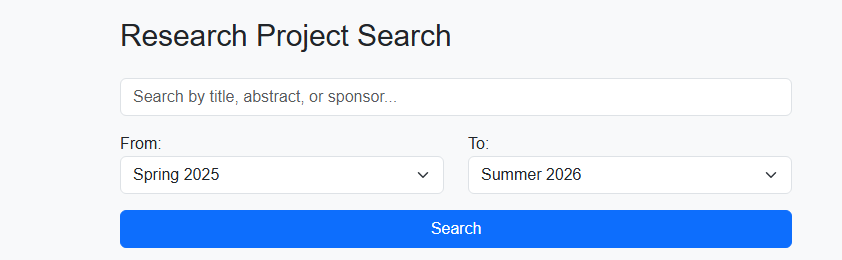
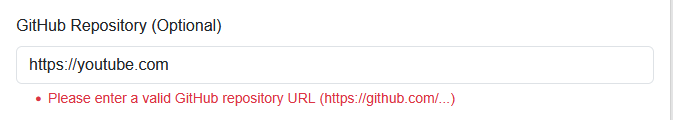
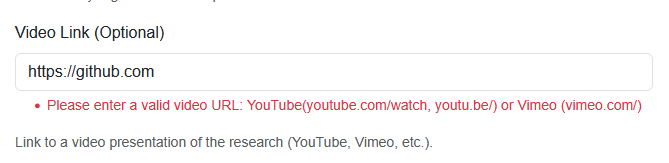
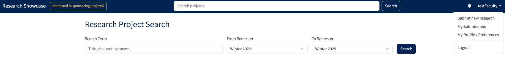
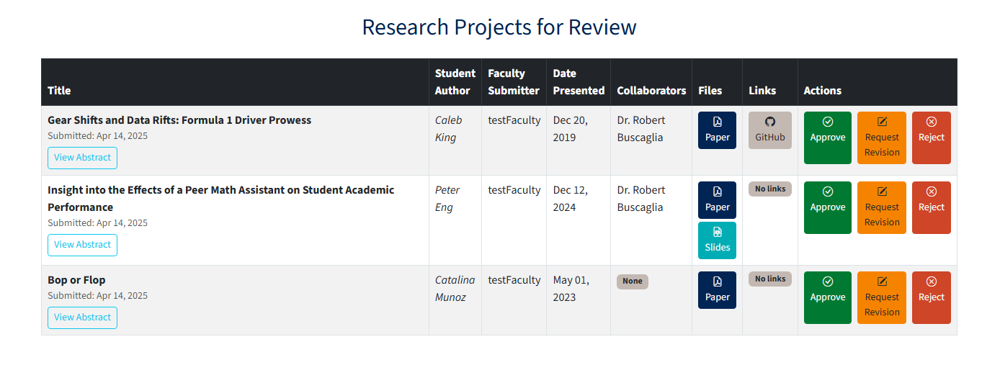
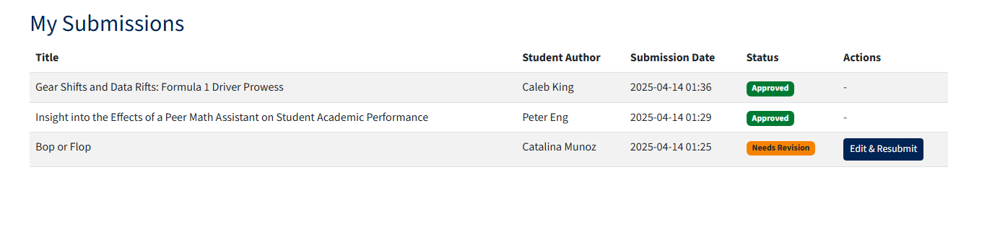

## Introduction

### Description
Northern Arizona University Department of Mathematics & Statistics Research Showcase is dedicated to developing a web-based platform for Northern Arizona University's Department of Mathematics & Statistics. This platform aims to organize, archive, and showcase student research, particularly senior capstone projects, with potential expansions for additional research and other departments.

[GitHub Link](https://github.com/Naalu/ds-senior-capstone-projects-website)

### Value Proposistion: 
For students, faculty, and external evaluators who need a reliable and structured platform to manage and discover research, the Mathematics & Statistics Research Showcase is a web-based academic repository that streamlines research submission, display, and discovery.

### Core Features (MVP)
✔ **Faculty-Driven Research Submission** – Faculty can submit student research with metadata (title, author, category, faculty advisor) and file uploads (PDF, PPT, images).

✔ **Admin Review & Approval** – Admins can approve, reject, or request revisions before projects are published.

✔ **Advanced Search & Filtering** – Users can search by title, research category, faculty advisor, or keywords to find relevant projects.

✔ **Public Research Repository** – Approved projects are accessible to students, faculty, and external audiences.

✔ **Secure Role-Based Access Control** – Only faculty and admins can submit, review, and manage projects.

✔ **Efficient Research Management** – Admins manage research projects, user roles, and system settings through an intuitive Django Admin Panel.

## Requirements

### Requirement:
As a faculty member, I want to browse through capstone projects so that I can review student work and provide feedback.

**Criteria:**

    Search and filter options for browsing projects by topic, student name, year, and keywords.
    Preview of project summaries and a link to view detailed information.
    Access to provide feedback or comments for each project.

**Issue(s):**  
 -[ User story 9 ](https://github.com/Naalu/ds-senior-capstone-projects-website/issues/23)   
 -[ User story 6 ](https://github.com/Naalu/ds-senior-capstone-projects-website/issues/20)    
 -[ Rylan begins development ](https://github.com/Naalu/ds-senior-capstone-projects-website/issues/4)  
 -[ Implement search and filtering system ](https://github.com/Naalu/ds-senior-capstone-projects-website/issues/40)  

**Pull Request**: [#65 - Date Range Search](https://github.com/Naalu/ds-senior-capstone-projects-website/pull/65)    
**Implemented by**: Rylan Harris  
**Approved by**:  Chris Reger  
**Print screen**:  
  

### Requirement:
As a student, I want to my capstone project stored online so that I can share my work with others in the department and prospective employers.

Enhance research submission form #38

**Criteria:**  

    The current research submission form needs improvements for better usability and data validation.  

    Implemented: Validation for Github and video links

**Issue(s):**  
 -[ User story 1 ](https://github.com/Naalu/ds-senior-capstone-projects-website/issues/15)  
-[ issue 38 ](https://github.com/Naalu/ds-senior-capstone-projects-website/issues/38)

**Pull Request**: [#Y - Implement link validations](https://github.com/Naalu/ds-senior-capstone-projects-website/pull/67)    
**Implemented by**: Jack Tomlon  
**Approved by**:  Chris Reger
**Print screen**:  



### Requirement:
As a student, I want to my capstone project stored online so that I can share my work with others in the department and prospective employers.

**Criteria:**
- Documentation should cover all models and APIs
- Examples should illustrate common use cases
- Authentication and authorization should be clearly explained
- Documentation should be accessible and well-organized
- The developer guide should help new contributors get started

**Issue(s):**  
 -[ User story 1 ](https://github.com/Naalu/ds-senior-capstone-projects-website/issues/15)   
 -[ Ethan begins development ](https://github.com/Naalu/ds-senior-capstone-projects-website/issues/7)  
 -[ Create API documentation ](https://github.com/Naalu/ds-senior-capstone-projects-website/issues/47)  

**Pull Request**: [#69 - API Documentation](https://github.com/Naalu/ds-senior-capstone-projects-website/pull/69)    
**Implemented by**: Ethan Ferguson  
**Approved by**:  Chris Reger  
**Print screen**: N/A as it is documentation


### Requirement:
Enhance the current research approval workflow for administrators.

**Criteria:**
    
    Admins should have a clear interface for reviewing submissions
    The workflow should support approval, rejection, and revision requests
    Faculty should receive notifications about status changes
    The system should maintain a history of approval actions
    The workflow should be efficient and user-friendly

**Issue(s):**  
 -[ Implement consistent styling across the platform #37 ](https://github.com/Naalu/ds-senior-capstone-projects-website/issues/37)   
 -[ Enhance research submission form #38 ](https://github.com/Naalu/ds-senior-capstone-projects-website/issues/38)    
 -[ Complete research approval workflow #41 ](https://github.com/Naalu/ds-senior-capstone-projects-website/issues/41)  
 -[ Implement notification system #42 ](https://github.com/Naalu/ds-senior-capstone-projects-website/issues/42)  

... alongside wrapping up various User Story needs

**Pull Request**: [feature: Comprehensive Updates including Homepage, Navbar, Notifications, and Search #68](https://github.com/Naalu/ds-senior-capstone-projects-website/pull/68)    
**Implemented by**: Chris Reger   
**Approved by**: Rylan Harris  
**Print screen**:  
  
  
  


## Tests

## Tests

This section details the automated testing suite implemented for the NAU Research Showcase application.

### 1. Test Framework Used

The automated tests were developed using **Django's built-in testing framework**. This framework is based on Python's standard `unittest` module and provides tools specifically tailored for testing Django applications, including:

- `django.test.TestCase`: A subclass of `unittest.TestCase` that handles database setup/teardown for each test and provides Django-specific assertions.
- `django.test.Client`: A test client used to simulate user interactions with the application via HTTP requests (GET, POST) without needing a running development server.

### 2. Link to Automated Tests Location

The automated unit and integration tests are located within the `tests.py` files inside each respective Django application directory. You can find them in the GitHub repository here:

- **Research App Tests:** `https://github.com/Naalu/ds-senior-capstone-projects-website/blob/main/research_showcase/research/tests.py`
- **Users App Tests:** `https://github.com/Naalu/ds-senior-capstone-projects-website/blob/main/research_showcase/users/tests.py`

### 3. Example Test Case

An example integration test verifies that an administrator can successfully approve a pending research project. This test checks the view logic, database update, redirection, and flash message display.

- **Functionality Being Tested:** The approve_research view function in research_showcase/research/views.py, which handles changing a project's status to 'approved'.
  - *Link to Code:* `https://github.com/Naalu/ds-senior-capstone-projects-website/blob/main/research_showcase/research/views.py#L222`
- **Test Case:** The `test_approve_project` method within the ResearchReviewProcessTest class in research_showcase/research/tests.py.
  - *Link to Test:* `https://github.com/Naalu/ds-senior-capstone-projects-website/blob/main/research_showcase/research/tests.py#309`

    ```python
    # research_showcase/research/tests.py
    class ResearchReviewProcessTest(TestCase):
        def setUp(self):
            # Create faculty author and admin user
            self.faculty_user = User.objects.create_user(...)
            self.admin_user = User.objects.create_user(
                username="reviewadmin", password="adminpass123", role="admin", email="..."
            )
            # Create a project with 'pending' status
            self.project = ResearchProject.objects.create(
                title="Project For Review", ..., approval_status="pending", author=self.faculty_user
            )
            self.client = Client()

        def test_approve_project(self):
            """Test approving a project updates its status"""
            # Log in as the administrator
            self.client.login(username="reviewadmin", password="adminpass123")
            # Simulate a GET request to the approval URL for the test project
            response = self.client.get(
                reverse("approve_research", args=[self.project.id]), follow=True
            )

            # Check that the user is redirected back to the review page
            self.assertRedirects(response, reverse("review_research"))
            # Check that a success message is displayed (optional but good)
            self.assertContains(response, "has been approved and published")

            # Verify the database state: Refresh the project instance from the DB
            self.project.refresh_from_db()
            # Assert that the project's status is now 'approved'
            self.assertEqual(self.project.approval_status, "approved")
    ```

### 4. Test Execution Results

The full test suite was executed successfully after implementing fixes and adding new tests. The command `python -m coverage run manage.py test` was run, executing all 64 tests across the `research` and `users` applications. All tests passed without errors or failures. A coverage report was also generated, demonstrating our target of *95%* test coverage is being met.

[!Testing Screenshot](images/Tests_results.png)

### 5. Automated Testing Via GitHub Actions

The project uses GitHub Actions to run the test suite and generate a coverage report. The workflow is defined in the `.github/workflows/django.yml` file.

[!GitHub Actions Screenshot](images/GitHub_Actions.png)

## Technology

Django is a popular choice for developing a project like the "ds-senior-capstone-projects-website" because of its benefits:

    Rapid Development: Django's built-in tools for routing, templating, and database management speed up development.

    Scalability: Django is well-suited for projects that might grow over time, such as expanding to accommodate more research departments.

    Built-in Admin Interface: Useful for managing research submissions and user roles without extra effort.

    Security: Django has built-in protection against common vulnerabilities like SQL injection, XSS, and CSRF.

    ORM (Object-Relational Mapping): Simplifies database interactions, ideal for handling structured data like student projects.

    Community Support: Extensive documentation and community resources make problem-solving easier.

Given the project's goals—to organize, archive, and showcase student research—Django's structure and capabilities are a strong fit.

## Demo

[Demo video zoom link](https://nau.zoom.us/rec/share/CmlAJC63hYkn50exwaGkVCBJ5cb6A5jL2ZW0qn9vWme7gI3_VaP6J0jDKteAFOV0.AH764y8pLmNSuSoz) 

## Code Quality

Our team employed several strategies and best practices to maintain high code quality throughout the development of the NAU Mathematics & Statistics Research Showcase platform:

1.  **Coding Standards:** We adhered to the [PEP 8](https://www.python.org/dev/peps/pep-0008/) style guide for Python code, enforcing conventions such as 4-space indentation, a maximum line length of 88 characters, meaningful naming, and the use of docstrings for modules, classes, and functions. We also followed HTML5 standards and used Bootstrap consistently for frontend styling.
2.  **Version Control & Branching:** We utilized Git for version control with a workflow centered around a stable `main` branch. New development occurred on feature (`feature/*`) or bugfix (`bugfix/*`) branches, ensuring the `main` branch always represented a working state.
3.  **Code Reviews via Pull Requests:** All code changes were submitted through GitHub Pull Requests (PRs). Each PR required review and approval from at least one other team member before merging into `main`. This process facilitated knowledge sharing, catching potential issues early, and ensuring adherence to standards. PR templates were used to provide context for the changes.
4.  **Comprehensive Testing:** We leveraged Django's built-in testing framework to develop a suite of unit and integration tests, located in the `tests.py` file of each application (`research` and `users`). Our testing strategy covered model methods, form validation, view logic, URL routing, and key user workflows. We used the `coverage` package to track test coverage, achieving our goal of **95% coverage**.
5.  **Automated Testing (CI):** A GitHub Actions workflow (`.github/workflows/django.yml`) was implemented to automatically run the entire test suite on every push and pull request to the `main` branch. This continuous integration setup provided immediate feedback on code changes and prevented regressions.
6.  **Issue Tracking:** We used GitHub Issues to track bugs, feature requests, and tasks. This provided traceability between requirements, development work, and code changes (often linked in PRs).
7.  **Documentation:** We emphasized maintaining clear documentation, including docstrings, comments for complex logic, and dedicated files like `README.md` and `CONTRIBUTING.md`. Documentation was updated alongside code changes.

These practices collectively fostered a development environment focused on producing reliable, maintainable, and high-quality code for the research showcase platform.

## Lessons Learned

During our second release of the Mathematics & Statistics Research Showcase platform, we gained valuable insights that would shape future development.  The lift to create complete testing coverage was a large task, but one that was well worth it.  The testing suite is now in place and will be used to test the project going forward.  Changes to the database cause a lot of extra work both in terms of creating migrations and updating the tests.  This is a process that can largely be avoided with better planning.
### Technical Insights

- Having clear acceptance criteria and a detailed design document would have helped us to complete the project faster and with a better understanding of the requirements
- Link validation improved data quality but highlighted the need for standardized validation across all forms
- Search functionality, particularly date range searching, proved more complex than anticipated
- Django's testing framework was effective but needs expanded coverage for edge cases and end-to-end testing
- Automated testing via GitHub Actions was a great addition to the project
- Selenium testing would be a great addition to the project to test the UI of the project, but would require a lot of time to implement and would be a large task to complete

### Process Improvements

- GitHub issue tracking provided good traceability, though requirements sometimes evolved during implementation
- Pull request reviews worked well but would benefit from more detailed criteria and more frequent reviews
- Earlier establishment of comprehensive documentation standards would aid maintenance and future development

### Future Considerations

With development continued, we will  prioritize the robust search architecture, ensure validation across all forms, and fine tune all areas of the project.

