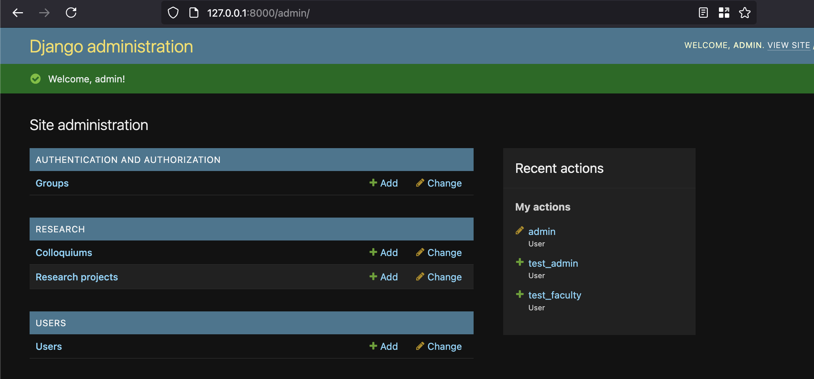
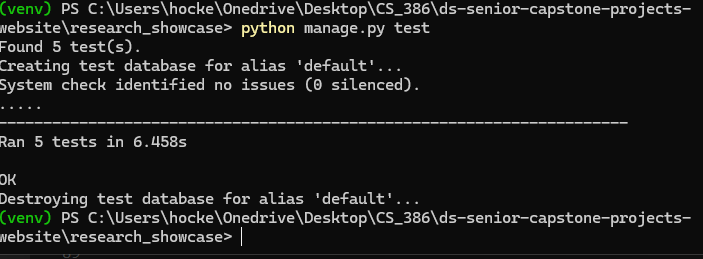

## Introduction

### Description
Northern Arizona University Department of Mathematics & Statistics Research Showcase is dedicated to developing a web-based platform for Northern Arizona University's Department of Mathematics & Statistics. This platform aims to organize, archive, and showcase student research, particularly senior capstone projects, with potential expansions for additional research and other departments.

### Value Proposistion: 
For students, faculty, and external evaluators who need a reliable and structured platform to manage and discover research, the Mathematics & Statistics Research Showcase is a web-based academic repository that streamlines research submission, display, and discovery.

### Core Features (MVP)
✔ **Faculty-Driven Research Submission** – Faculty can submit student research with metadata (title, author, category, faculty advisor) and file uploads (PDF, PPT, images).

✔ **Admin Review & Approval** – Admins can approve, reject, or request revisions before projects are published.

✔ **Advanced Search & Filtering** – Users can search by title, research category, faculty advisor, or keywords to find relevant projects.

✔ **Public Research Repository** – Approved projects are accessible to students, faculty, and external audiences.

✔ **Secure Role-Based Access Control** – Only faculty and admins can submit, review, and manage projects.

✔ **Efficient Research Management** – Admins manage research projects, user roles, and system settings through an intuitive Django Admin Panel.

## Requirements

### Requirement:
As a student, I want to my capstone project stored online so that I can share my work with others in the department and prospective employers.

**Criteria:**

    Functionality for documents (PDF, LaTeX) and supplementary files (data sets, code, etc.).
    Ability to add a project title, description, and keywords.
    Option to tag faculty or collaborators related to the project.

**Issue(s):**  
 -[ User story 1 ](https://github.com/Naalu/ds-senior-capstone-projects-website/issues/15)  
 -[ Create comprehensive sample data ](https://github.com/Naalu/ds-senior-capstone-projects-website/issues/44)

**Pull Request**: [#Y - Implement refined user roles](link-to-pull-request)    
**Implemented by**: Jack Tomlon  
**Approved by**: Karl Reager   
**Print screen**: Back-end no availiable screenshot. 

### Requirement:
 As an administrator, I want to store capstone projects in a central location so that I can store and manage them more easily.

**Criteria:**

    - Focusing on Faculty and Admin roles
    - Enabling Faculty to submit research on behalf of students
    - Allowing Admins to access both submission and review features
    - Improving the permission system for more intuitive access control
    - Updating the documentation to reflect these changes including the README and usage guides for Faculty and Admins

**Issue(s):**
- [#51 - Create User Documentation](https://github.com/Naalu/ds-senior-capstone-projects-website/issues/16)
- [#16 User Story 2](https://github.com/Naalu/ds-senior-capstone-projects-website/issues/16)

**Pull Request**: [#Y - Implement refined user roles](link-to-pull-request)  
**Implemented by**: Karl Reger  
**Approved by**: Jack Tomlon  
**Print screen**: 

## Tests

    You should implement automated tests that aim to verify the correct behavior of your code. Provide the following information:
    Test framework you used to develop your tests (e.g., JUnit, unittest, pytest, etc.)
    Link to your GitHub folder where your automated unit tests are located.
    An example of a test case. Include in your answer a GitHub link to the class being tested and to the test.
    A print screen showing the result of the execution of the automated tests. 

Django's built in testing system. In each Django module/app there is a test.py file for testing.

- https://github.com/Naalu/ds-senior-capstone-projects-website/blob/main/research_showcase/research/tests.py 

- https://github.com/Naalu/ds-senior-capstone-projects-website/blob/main/research_showcase/users/tests.py  

  

## Technology

Django is a popular choice for developing a project like the "ds-senior-capstone-projects-website" because of its benefits:

    Rapid Development: Django's built-in tools for routing, templating, and database management speed up development.

    Scalability: Django is well-suited for projects that might grow over time, such as expanding to accommodate more research departments.

    Built-in Admin Interface: Useful for managing research submissions and user roles without extra effort.

    Security: Django has built-in protection against common vulnerabilities like SQL injection, XSS, and CSRF.

    ORM (Object-Relational Mapping): Simplifies database interactions, ideal for handling structured data like student projects.

    Community Support: Extensive documentation and community resources make problem-solving easier.

Given the project's goals—to organize, archive, and showcase student research—Django's structure and capabilities are a strong fit.

## Deployment

Currently our project is being hosted locally but we have identified several cloud platforms that are suitable for hosting our project. The goal is to deploy the system in a cloud environment to improve its scalability, availability, and accessibility. If our project shows promise Northern Arizona University Department of Mathematics & Statistics may take over the project for further development and implementation.

Here are some cloud hosting platforms we discussed using:

    AWS(Amazon Web Service):
    AWS is one of the most popular cloud services used today. It offers feww credits for students, and the platform provides an array of tool and services. These include EC2 for virtucal servers, S3 for storage, and RDS for database management. AWS is ideal for larger, complex projects that may require high scalability and avaliablity.

    Microsoft Azure: 
    Azure is also a great alternative for web cloud service. Azure offers $100 in free credits and is free for students as well. They have Azure App Service for app hoting and Azure SQL Database for database management. Azure has integreation with Visual Studio which makes it an amazing choice for our project. Azure also supports automate deployment pipelines through CI/CD.

## Licensing

We chose the MIT license in order to have simple, short, and relatively understandable agreement. It gives minimal restrictions to anyone who wants to use the code as long as reasonable credit is given.

## Readme File

- [ReadMe](https://github.com/Naalu/ds-senior-capstone-projects-website/blob/main/README.md)  
- [Contributing ](https://github.com/Naalu/ds-senior-capstone-projects-website/blob/main/CONTRIBUTING.md) 
- [Code of Conduct](https://github.com/Naalu/ds-senior-capstone-projects-website/blob/main/CODE_OF_CONDUCT.md)
- [License](https://github.com/Naalu/ds-senior-capstone-projects-website/blob/main/LICENSE)

## UX Design

## Lessons Learned

Improve Communication: Throughout this project, we discovered that clear and consistent communication is key to avoiding delays and misundersandings. Implimenting more structired communication methods, such as regualr check-ins and better alignment on task dependencies, will ensure that everyone is on the same page and help keep the project moving forward.

Documentation and Sharaing: Another learning point was the need for better documentation. As the project progressed it became clear that having a centralized place for important information could help avoid confusion. 

Understand Django: Throughout the first release, it became clear that a deeper understanding of Django's core components was essential for this project. While most team members had a general grasp of the framework, we faced challenges in leveraging Django's built-in tools and features effectively. This led to some inefficiencies and delays when implementing certain features. 

## Demo
