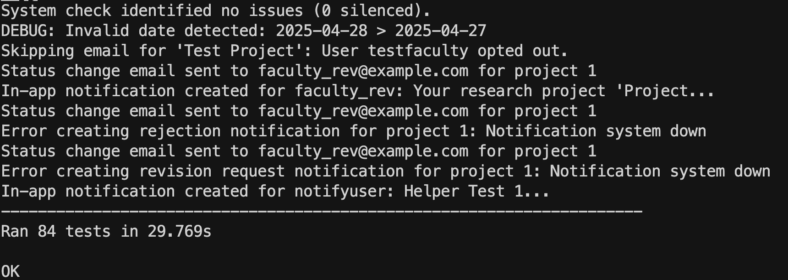
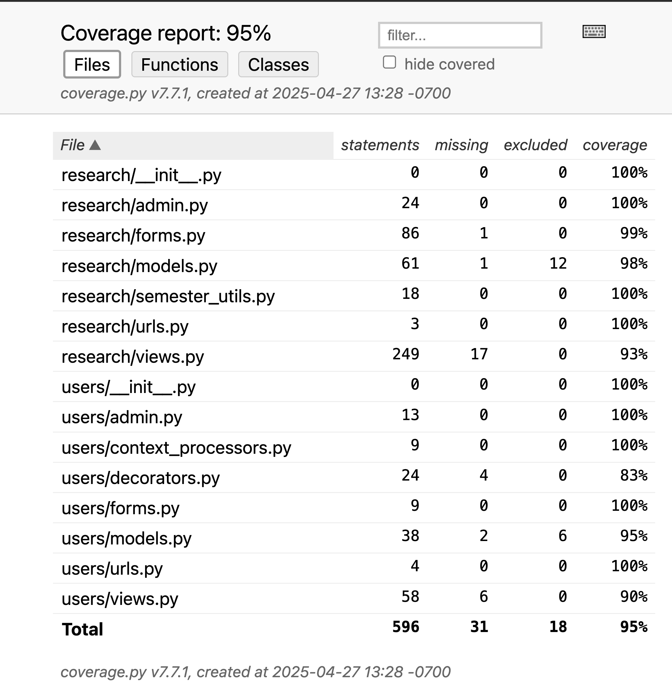

# Description

Northern Arizona University Department of Mathematics & Statistics Research Showcase is dedicated to developing a web-based platform for Northern Arizona University's Department of Mathematics & Statistics. This platform aims to organize, archive, and showcase student research, particularly senior capstone projects, with potential expansions for additional research and other departments.

## Verification

This section demonstrates how we ensured that the project was developed properly using a robust testing strategy.

### Test Framework

The automated tests for the NAU Research Showcase were developed using **Django's built-in testing framework**. This framework is based on Python's standard `unittest` module and provides specialized tools for testing Django applications, including:

- `django.test.TestCase`: A subclass of `unittest.TestCase` that manages database setup/teardown per test and offers Django-specific assertions.
- `django.test.Client`: A test client for simulating HTTP requests (GET, POST) to test views without a live server.
- `unittest.mock.patch`: A decorator/context manager from Python's standard library, integrated seamlessly with Django's test runner, used for isolating components by replacing dependencies with mock objects during tests.

This framework was chosen because it integrates directly with the Django project structure, simplifies database interactions in tests, and provides convenient utilities for testing web application features like views, forms, and models.

### Automated Tests Location

The automated unit and integration tests are located within the `tests` directory inside each respective Django application folder:

- **Research App Tests:** [research_showcase/research/tests/](https://github.com/Naalu/ds-senior-capstone-projects-website/tree/main/research_showcase/research/tests)
- **Users App Tests:** [research_showcase/users/tests/](https://github.com/Naalu/ds-senior-capstone-projects-website/tree/main/research_showcase/users/tests)

### Mock Object Usage Example

Mock objects are crucial for isolating the unit under test from its external dependencies (like external services, email systems, or complex related components). This ensures that the test focuses solely on the logic of the unit itself. We use Python's `unittest.mock.patch` decorator for this purpose.

Here is an example demonstrating the use of mock objects to test the `approve_research` view function in isolation. This test verifies the core logic of approving a project (changing status, saving, redirecting) without actually sending emails or creating real in-app notifications.

**Test Case:** `test_approve_research_isolation` in `research_showcase/research/tests/test_views.py`

```python
# research_showcase/research/tests/test_views.py

# ... other imports ...
from unittest.mock import patch, MagicMock
from django.urls import reverse
from django.test import RequestFactory
from research.models import ResearchProject, Notification
from users.models import User
from ..views import approve_research # Function being tested

# ... other test classes ...

class ApproveResearchMockTest(TestCase):
    """Tests for the approve_research view with mock objects."""

    def setUp(self):
        # Create necessary users and a project
        self.faculty_user = User.objects.create_user(
            username="testfaculty", password="password123", role="faculty", email="faculty@test.com"
        )
        self.admin_user = User.objects.create_user(
            username="testadmin_approver", password="password123", role="admin", email="admin@test.com"
        )
        self.project = ResearchProject.objects.create(
            title="Pending Project for Mock Test",
            student_author_name="Test Student",
            abstract="This is a test abstract.",
            approval_status="pending",
            author=self.faculty_user,
            # Add other required fields as necessary
        )
        # Use RequestFactory to create a request object independent of the test client
        self.factory = RequestFactory()

    @patch("research.views.send_status_change_email") # Mock the email sending function
    @patch("research.views.create_in_app_notification") # Mock the notification creation function
    def test_approve_research_isolation(self, mock_notification, mock_email):
        """
        Test the approve_research view in isolation using mocks.
        Verifies:
        1. Project status changes to 'approved'.
        2. Correct redirection occurs.
        3. It sends an email notification (mocked)
        4. It creates an in-app notification (mocked)
        """
        # Create a request object as if coming from the admin user
        # Note: We use RequestFactory here for more direct view testing,
        # but Client.get/post could also be used with mocks.
        request = self.factory.get(reverse("approve_research", args=[self.project.id]))
        request.user = self.admin_user
        request._messages = MagicMock() # Mock the messages framework storage

        # Call the view function directly with the request and project ID
        response = approve_research(request, self.project.id)

        # 1. Check database state
        self.project.refresh_from_db()
        self.assertEqual(self.project.approval_status, "approved")

        # 2. Check response (should be a redirect)
        self.assertEqual(response.status_code, 302) # Status code for redirect
        self.assertEqual(response.url, reverse("review_research"))

        # 3 & 4. Verify mocked functions were called appropriately
        mock_email.assert_called_once()
        mock_notification.assert_called_once()

        # Optional: Inspect arguments passed to mocks
        email_call_args = mock_email.call_args
        self.assertEqual(email_call_args[0][0], self.project) # First arg was the project instance
        self.assertEqual(email_call_args[1]['subject_prefix'], "Research Project Approved")

        notification_call = mock_notification.call_args
        self.assertEqual(notification_call[0][0], self.faculty_user) # First arg was the recipient user
        self.assertTrue("approved and published" in notification_call[0][1]) # Check message content

```

**Explanation:**

1. `@patch("research.views.send_status_change_email")` and `@patch("research.views.create_in_app_notification")`: These decorators replace the actual `send_status_change_email` and `create_in_app_notification` functions within the `research.views` module with mock objects (`mock_email` and `mock_notification`) for the duration of the `test_approve_research_isolation` execution.
2. `mock_email.assert_called_once()` and `mock_notification.assert_called_once()`: These assertions verify that the view logic attempted to call the (now mocked) email and notification functions exactly once, as expected during the approval process.
3. Inspecting Call Arguments: We further check `mock_email.call_args` and `mock_notification.call_args` to ensure these mocked functions were called with the correct arguments (e.g., the correct project instance, user, and subject line/message content).

This approach allows us to test the core logic of the `approve_research` view (database update, redirection) without relying on the actual implementation or potential failures of the external email and notification systems.

**Links:**

- **Class/Function Being Tested:** [`research_showcase/research/views.py#L222`](https://github.com/Naalu/ds-senior-capstone-projects-website/blob/main/research_showcase/research/views.py#L222) (approve_research function)
- **Test Case:** [`research_showcase/research/tests/test_views.py#L724`](https://github.com/Naalu/ds-senior-capstone-projects-website/blob/main/research_showcase/research/tests/test_views.py#L722) (test_approve_research_isolation method)

### Test Execution and Coverage

The project aims for high test coverage to ensure reliability. Tests are run using the `coverage` package integrated with Django's test runner.

**Execution Command (from `research_showcase` directory):**

```bash
python -m coverage run manage.py test
```

**Coverage Report Command:**

```bash
coverage report
```

**Successful Test Execution & Coverage Report:**

- 
  - The "OK" indicates that all tests passed.
- 
  - The coverage report shows the percentage of code that is covered by tests.

The current test coverage is **95%**, meeting our project goal and demonstrating a high degree of verification through automated testing. The tests cover models, forms, views, utility functions, and user workflows, ensuring that core functionalities behave as expected and regressions are caught early. The use of mock objects further enhances the quality by allowing focused unit testing.

## Acceptance Test

This project used the automated tests developed using **Django's built-in testing framework**. This framework is based on Python's standard `unittest` module and provides tools specifically tailored for testing Django applications, including:

- `django.test.TestCase`: A subclass of `unittest.TestCase` that handles database setup/teardown for each test and provides Django-specific assertions.
- `django.test.Client`: A test client used to simulate user interactions with the application via HTTP requests (GET, POST) without needing a running development server.

( Include in your answer a GitHub link to the test and an explanation about the tested feature.
    A print screen/video showing the acceptance test execution. )


# Validation

## Script

### Product Task Test  

The processes that we had the users go through were to: use the main landing page to make a keyword search, sign in to the system, submit a project (with given data), and approve the project be added to the database. We observed and noted their impressions to using the system and asked/answered questions throughout the process.

### Questions  

These are the general questions we tried to address in these interviews though the specific responses were subject to the interviewer's communication style, the specificity of notes taken during the interview, and the flow of the interaction.

- How do you like layout of the landing page? Any specific thoughts or feedback?  
- Do you feel that this design suits the audience and purpose we are trying to address?  
- Are there any additional features that you feel would improve this system?  
- How likely are to use this product? What would it take for it to be usable for the college?  

## Results


### Robert Buscaglia, Professor and Capstone Advisor for Data Science Program


#### Interview Response

On a scale of 1 to 10, how would you rate the layout of our application?

    "It's a 9"

From our earlier interview one of your biggest requirements was to allow muliple file formats for project. Were we able to sastisfy that requirement?

    "Yes, each project can have a image file for posters, videos not hosted but linked to is perfect, and then links to various sites pertaining to projects. I don't see any problems here."

You suggested a faculty driven submission process which we ended up pursuing. Do you still support those method?

    "I still think it is the better way to go about this, and I'm glad you made the switch"

Is there any features we didn't mention previously that you are glad to have in place?

    "The notification system is a great feature. Realistically we would have a dedicated department email for it."

Would you use the project in it's current state?

    "I could use it in it's current state as we still do not have a dedicated place for these projects but I would prefer to have the critiques corrected first. It just needs some refinements to be completly accurate."

#### Summary and Reflection

Dr. Robert Buscaglia first impressions were overall approval of the projects state. From the upload, approval, to searching and browsing the framework he only had minor critques and corrections that we could implement that we had described to him earlier. For example project had a student author, author (as in faculty submission) and collorators. Instead, he mentioned in order to be more accurate it should be student author, faculty advisor, and collaborators and having the faculty who submitted the project more in the backround instead of being listed in the open. He needs that information but whats important is the student authors and the faculty advisor that advised the project whether it be a class project or research. He apprciated the search layout and how each project had thumbnails shown at all times. One of his final statments is that the website is "really useful" he helped us outline a real path to getting the project up the chain in the Mathmatic and Statistics department so that it could be thouroughly reviewed for real implementation.

#### Associated Created Issues
- [Include Additional Fields in Project Data Model #71](https://github.com/Naalu/ds-senior-capstone-projects-website/issues/71)
- [Expand Search Capabilities #72](https://github.com/Naalu/ds-senior-capstone-projects-website/issues/72)
- [Incorporate NAU Authentication and Sign-In #73](https://github.com/Naalu/ds-senior-capstone-projects-website/issues/73)
- [Incorporate Values Based on Provided Poster or Research Paper #74](https://github.com/Naalu/ds-senior-capstone-projects-website/issues/74)

### Roy St. Laurent, Professor and Chair for the Math & Stats Department 

#### Interview Response

Product Task Test   
    When going through the project submission process, Roy mentioned that the fields that were required weren't clearly identified and, as a result, was confused about which fields needed to be completed.  

    He noticed the warnings about needing to resubmit files and recommended only asking for them after the other fields are validated to improve the user experience.    

    When asked about the breadth of file types being accepted, he said that it would be completely acceptable to require pdfs for all the non-image fields to improve consistency and usability.   

How do you like layout of the landing page? Any specific thoughts or feedback?  

    Dr. St. Laurent liked the layout and landing page though they came up later as possibly needing to be changed.  There was some talk about colorblind accessibility and we explained that NAU colors were used. He noted that it was a good choice for that.

Do you feel that this design suits the audience and purpose we are trying to address?  

    Roy mentioned that the current system suits handling undergraduate research quite well at this point. He did bring up the idea of including other types of research, including colloquia. We had intended to handle various research types with the system and told him as much. He explained that, in order to properly present more than undergraduate research, we would likely have to change our presentation to include some sort of category field as well as a distinct page to present graduate or faculty research. This would likely need to include a change to the landing page so that these different pages could be accessed independently.

Are there any additional features that you feel would improve this system?  

    He also mentioned incorporating Arxiv linking at some level in this part of the conversation.


How likely are to use this product? What would it take for it to be usable for the college?  

    Dr. St. Laurent said that he thought the system would be good for a basic system that the department could use as an internal tool but would likely need significant changes to be incorporated into NAU's web systems. Notably, utilizing NAU's sign-in and authentication system and, potentially, making changes to adhere with ADA requirements. Because the website wouldn't be required to complete classwork, ADA compliance isn't necessary but would help sell it.

#### Summary and Reflection

Dr. St. Laurent gave a lot of really valuable criticism with a very important and unique perspective. Overall, he liked the project and gave clear avenues for how it could be expanded to fit the needs of the department as a whole. His feedback validated this as a method for handling undergraduate projects, specifically capstones, but showed the flaws in applying this to a wider audience without significant changes. That said, he had very few issues with the actual use and implementation of the system. Roy also pointed us to other resources, Dr. Nándor Sieben and Dana Ernst, that could be useful in continuing development and getting more constructive feedback.

#### Associated Created Issues
- [Include Additional Fields in Project Data Model #71](https://github.com/Naalu/ds-senior-capstone-projects-website/issues/71)
- [Incorporate NAU Authentication and Sign-In #73](https://github.com/Naalu/ds-senior-capstone-projects-website/issues/73)
- [ADA Compliance Requirements Definition #75](https://github.com/Naalu/ds-senior-capstone-projects-website/issues/75)
- [Improvements to Submission Process UI/UX #76](https://github.com/Naalu/ds-senior-capstone-projects-website/issues/76)
- [Arxiv Paper Linking #77](https://github.com/Naalu/ds-senior-capstone-projects-website/issues/77)

### Data Science Capstone Student (Name kept privite by request)

#### Interview Response  

Product Task Test   

    Despite not being faculty that would actual use the backend systems, we still had the student go through the same process for consistency and to get any additional feedback.  

    When doing a search in the system, the student mentioned that the ranges on the date selectors was unusually wide despite no projects being in those ranges.

    They found the sign in system very easy to use and the menuing to be intuitive.

    They mentioned that the submission system felt long but didn't have any specific critique on how to shorten it.

    When submitting feedback, they wanted to be able to specify fields that needed to be changed (beyond just in text).

How do you like layout of the landing page? Any specific thoughts or feedback?  

    The student explained that they liked that the landing page was simple and clean. 

Do you feel that this design suits the audience and purpose we are trying to address?  

    They said that they liked the general design and mentioned that they would like the be able to use it for their current project. They mentioned that it would have been really useful for reviewing past capstone posters (an assignment they had toward the beginning of the semester).

Are there any additional features that you feel would improve this system?  

    Aside from ideas mentioned in the Product Test, no additional feature ideas were given.

How likely are to use this product? What would it take for it to be usable for the college?  

    They would have definitely used it at least once or twice throughout the semester and, when the resumes were brought up, noted that it would be nice to be able to reference it for job applications. The student then wanted to make sure that it was possible to link directly to a specific project, potentially with a QR code.

#### Summary and Reflection

Getting another student's perspective was quite useful for some UI/UX testing but they didn't have a lot to contribute for making the project more market-ready. Their experience with using the system was somewhat validating but, because they are fairly similar to the developers, they don't give much additional perspective. In the end, they gave feedback that is very simple and easy to act on but nothing that will make significant improvements to the project.

#### Associated Created Issues
- [Improvements to Submission Process UI/UX #76](https://github.com/Naalu/ds-senior-capstone-projects-website/issues/76)
- [Improve Feedback System #78](https://github.com/Naalu/ds-senior-capstone-projects-website/issues/78)
- [QR Code Linking Method #79](https://github.com/Naalu/ds-senior-capstone-projects-website/issues/79)

## Reflection and Refinements 

There are some minor UI/UX improvements that can be made throughout the system that were mentioned throughout these interviews/test though the overall system was quite well recieved. The revamped navigation menu's and feedback system went over well and had little to no complaints. It seems the submission process has some issues that can be iterated on. The tests we did had pretty satisfying results, the users seemed to be able to pick up and use the system quite effectively. That said, it's a pretty limited scope and doing more would likely reveal issues that we've missed.

From the feedback that we got from professors and faculty, it seems as though we've accomplished the original concept. That said, to make the product truly marketable to the department, some significant changes would need to be made. Most notably, integration with NAU web services via ITS and expanding the system to handle more than undergraduate research/projects.

